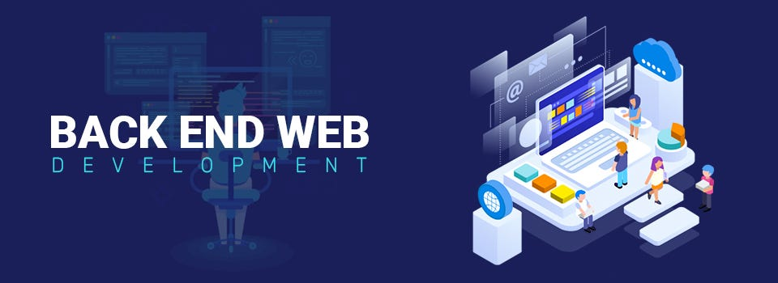

# Atlas Web Backend

Welcome to the **_Atlas Web Backend_** repository! This repository contains a collection of various backend projects and exercises that cover a wide range of web development topics, including authentication, data manipulation, caching, and more. Each project is organized into its own directory and represents a specific aspect of backend development.

## Table of Contents :pushpin:

- [0x0B_redis_basic](https://github.com/SvitLanaPavl/atlas-web_back_end/tree/main/0x0B_redis_basic)  
- [Basic_authentication](https://github.com/SvitLanaPavl/atlas-web_back_end/tree/main/Basic_authentication)  
- [ES6_basic](https://github.com/SvitLanaPavl/atlas-web_back_end/tree/main/ES6_basic)
- [ES6_classes](https://github.com/SvitLanaPavl/atlas-web_back_end/tree/main/ES6_classes)
- [ES6_data_manipulation](https://github.com/SvitLanaPavl/atlas-web_back_end/tree/main/ES6_data_manipulation)
- [ES6_promise](https://github.com/SvitLanaPavl/atlas-web_back_end/tree/main/ES6_promise)  
- [MySQL_Advanced](https://github.com/SvitLanaPavl/atlas-web_back_end/tree/main/MySQL_Advanced)  
- [NoSQL](https://github.com/SvitLanaPavl/atlas-web_back_end/tree/main/NoSQL#)
- [Node_JS](https://github.com/SvitLanaPavl/atlas-web_back_end/tree/main/Node_JS)
- [Session_authentication](https://github.com/SvitLanaPavl/atlas-web_back_end/tree/main/Session_authentication)
- [Unittests_and_integration_tests](https://github.com/SvitLanaPavl/atlas-web_back_end/tree/main/Unittests_and_integration_tests)  
- [caching](https://github.com/SvitLanaPavl/atlas-web_back_end/tree/main/caching)  
- [pagination](https://github.com/SvitLanaPavl/atlas-web_back_end/tree/main/pagination)
- [personal_data](https://github.com/SvitLanaPavl/atlas-web_back_end/tree/main/personal_data)
- [python_async_comprehension](https://github.com/SvitLanaPavl/atlas-web_back_end/tree/main/python_async_comprehension)
- [python_async_function](https://github.com/SvitLanaPavl/atlas-web_back_end/tree/main/python_async_function)  
- [python_variable_annotations](https://github.com/SvitLanaPavl/atlas-web_back_end/tree/main/python_variable_annotations)
- [queuing_system_in_js](https://github.com/SvitLanaPavl/atlas-web_back_end/tree/main/queuing_system_in_js)
- [unittests_in_js](https://github.com/SvitLanaPavl/atlas-web_back_end/tree/main/unittests_in_js)
- [user_authentication_service](https://github.com/SvitLanaPavl/atlas-web_back_end/tree/main/user_authentication_service)

## Current Focus

🔭 I’m currently working on **Full-Stack Software Development Program** with Atlas School, Tulsa.

🌱 At this time, I am learning **Backend Technologies**.

👯 I’m looking to collaborate on **Full-Stack Web Development projects**.

💬 Ask me about **Full-Stack Web Development**.

📫 How to reach me: lanapavlovska90@gmail.com.

_Feel free to explore each project directory for more detailed information and code examples. If you have any questions or suggestions, please don't hesitate to reach out!_